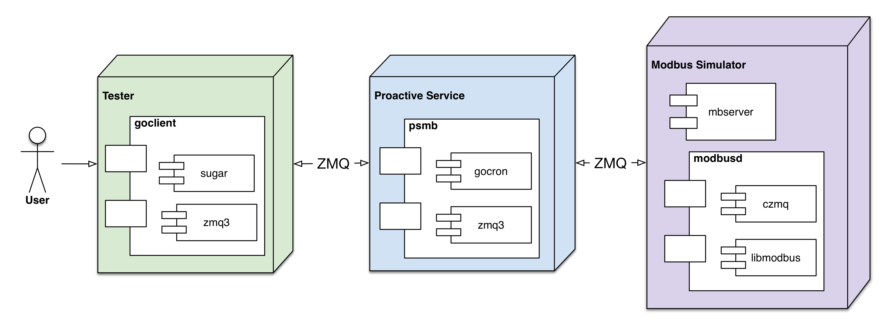

# psmb
[](http://godoc.org/github.com/taka-wang/psmb)
[](https://github.com/taka-wang/psmb/tags) 
[](https://github.com/taka-wang/psmb/releases/latest)
[](https://imagelayers.io/?images=takawang/psmb:latest)

Proactive service for [modbusd](https://github.com/taka-wang/modbusd)

---

# Unit tests

- [binary](binary_test.go)
- [types](types_test.go)

---

# Contracts (Interfaces)

- ProactiveService: proactive service
- MbtcpReadTask: read/poll task map
- MbtcpSimpleTask: simple task map

---
## Docker 

### Docker Compose

```bash
docker-compose up
# rebuild images
docker-compose build
```

### Build images manually

```bash
# build modbus simulator image
docker build -t takawang/mbd test/mb/.
# build psmb image
docker build -t takawang/psmb .
# build goclient image
docker build -t takawang/psmb-goclient test/goclient/.
```

### Run images
```bash
# run modbus simulator
docker run -v /tmp:/tmp -itd --name=mbd takawang/mbd 

# run psmb
docker run -v /tmp:/tmp -itd takawang/psmb
#docker run -v /tmp:/tmp -it takawang/psmb /bin/bash

# run goclient
docker run -v /tmp:/tmp --link mbd -it takawang/psmb-goclient

```

### Deployment Diagram



