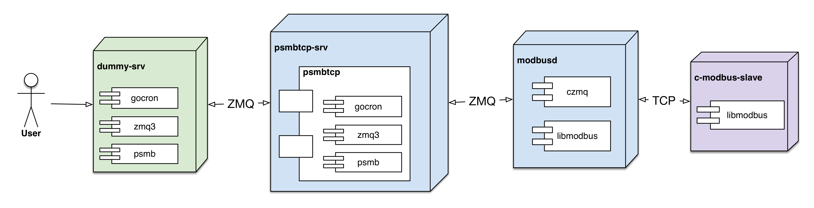

# psmb

[](http://dev.cmwang.net/taka-wang/psmb)
[](http://godoc.org/github.com/taka-wang/psmb)

Proactive service library for [modbusd](https://github.com/taka-wang/modbusd)

---

## Contracts (Interfaces)

- IProactiveService: proactive service
- IReaderTaskDataStore:  read/poll task map
- IWriterTaskDataStore: write task map
- IHistoryDataStore: history map


## Docker

### Docker Compose

```bash
docker-compose build  --pull
docker-compose up --abort-on-container-exit
```

### From docker images

```bash

# run modbus slave
docker run -itd --name=slave takawang/c-modbus-slave:x86

# run modbusd
docker run -v /tmp:/tmp --link slave -it --name=modbusd takawang/modbusd:x86

# run psmbtcp-srv
docker build -t takawang/psmbtcp-srv tcp-srv/.
docker run -v /tmp:/tmp -itd takawang/psmbtcp-srv

# run dummy-srv
docker build -t takawang/dummy-srv test/dummy-srv/.
docker run -v /tmp:/tmp --link slave -it takawang/dummy-srv
```

## Continuous Integration

I do continuous integration and build docker images after git push by self-hosted drone.io server and [dockerhub]((https://hub.docker.com/r/takawang/c-modbus-slave/)) service.


## Deployment Diagram



---

## Unit tests

- binary
- types

## Test cases

### Binary

- [x] Bytes to 16-bit integer array tests
    - [x] `BytesToUInt16s` in big endian order - (1/4)
    - [x] `BytesToUInt16s` in little endian order - (2/4)
    - [x] `BytesToInt16s` in big endian order - (3/4)
    - [x] `BytesToInt16s` in little endian order - (4/4)
- [x] Bytes to 32-bit integer array tests
    - [x] `BytesToUInt32s` in (ABCD) Big Endian order - (1/4)
    - [x] `BytesToUInt32s` in (DCBA) Little Endian order - (2/4)
    - [x] `BytesToUInt32s` in (BADC) Mid-Big Endian order - (3/4)
    - [x] `BytesToUInt32s` in (CDAB) Mid-Little Endian order - (4/4)
    - [x] `BytesToInt32s` in (ABCD) Big Endian order - (1/4)
    - [x] `BytesToInt32s` in (DCBA) Little Endian order - (2/4)
    - [x] `BytesToInt32s` in (BADC) Mid-Big Endian order - (3/4)
    - [x] `BytesToInt32s` in (CDAB) Mid-Little Endian order - (4/4)
- [x] Bytes to 32-bit float array tests
    - [x] `BytesToFloat32s` in (ABCD) Big Endian order - (1/4)
    - [x] `BytesToFloat32s` in (DCBA) Little Endian order - (2/4)
    - [x] `BytesToFloat32s` in (BADC) Mid-Big Endian order - (3/4)
    - [x] `BytesToFloat32s` in (CDAB) Mid-Little Endian order - (4/4)
- [x] Bytes/registers utility tests
    - [x] `BitStringToUInt8s` test
    - [x] `BitStringToUInt8s` test - left comma
    - [x] `BitStringToUInt8s` test - right comma
    - [x] `BitStringToUInt8s` test - left, right comma
    - [x] `RegistersToBytes` test
    - [x] `BytesToHexString` test
    - [x] `DecimalStringToRegisters` test
    - [x] `DecimalStringToRegisters` test - left comma
    - [x] `DecimalStringToRegisters` test - right comma
    - [x] `DecimalStringToRegisters` test - left, right comma
    - [x] `HexStringToRegisters` test
    - [x] `HexStringToRegisters` test - wrong length
    - [x] `LinearScalingRegisters` test
    - [x] `LinearScalingRegisters` test - (0,0,0,0)
    - [x] `LinearScalingRegisters` test - reverse


### Types

#### Upstream structure test

- [x] One-off modbus tcp struct tests
    - [x] `mbtcp.once.read` request test
    - [x] `mbtcp.once.read` response test
- [x] get/set modbus tcp timeout struct tests
    - [x] `mbtcp.timeout.read` request test
    - [x] `mbtcp.timeout.read` response test
    - [x] `mbtcp.timeout.update` request test
    - [x] `mbtcp.timeout.update` response test
    - [x] `mbtcp.once.write` request test
    - [x] `mbtcp.once.write` response test

#### Downstream structure test

- [x] modbus tcp downstreamstruct tests
    - [x] `read` request test
    - [x] `single read` response test
    - [x] `multiple read` response test
    - [x] `single write` request test
    - [x] `multiple write` request test
    - [x] `set timeout` request test
    - [x] `get timeout` response test

---

## UML 


